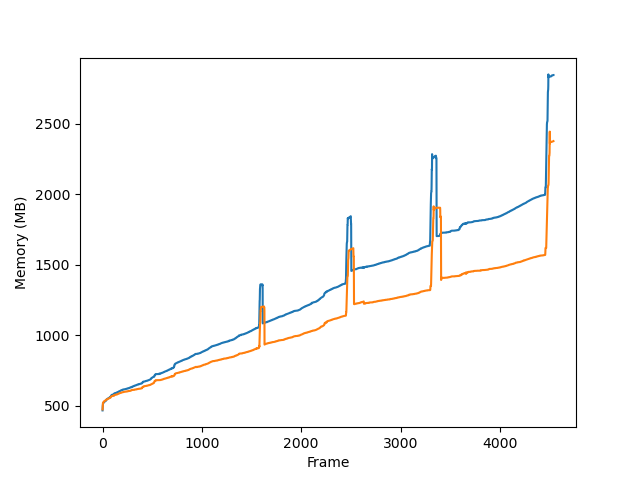

## Description
This is a modified version of **[ORB-SLAM3](https://github.com/UZ-SLAMLab/ORB_SLAM3)**.

In the original version, bad map points and keyframes are just set flags but are not removed from memory, which will then consume more unnecessary memory. In this modified one, we use shared_ptr to manage these memory, a comparison of memory usage on sequence 00 from KITTI is illustarted in the following figure. 

For installation and running, you can refer to the original page. 

The system has not been fully tested up to now.  
